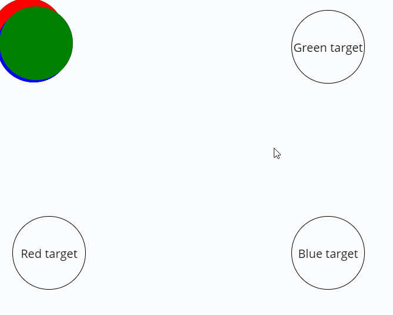
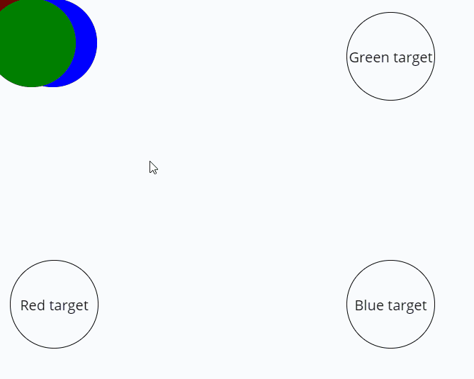

# JS 3.0 HW6

# 1

## UA

Реалізувати клас `EventBus`, який буде мати 2 базові методи. Окрім цього треба додати обробку помилок та покрити код тестами. Для виконання треба використати код, наведений нижче.

Вимоги до завдання:

- [ ] Написати код використовуючи колбеки
- [ ] Повинна бути обробка помилок
- [ ] Покрити код тестами

## RU

Реализовать класс `EventBus`, с двумя базовыми методами. Кроме того нужно добавить обработку ошибок и покрыть код тестами. Для выполнения нужно использовать код ниже.

Требования к заданию:

- [ ] Написать код используя колбеки
- [ ] Должна быть обработка ошибок
- [ ] Покрыть код тестами

```js
/**
 * @class
 */
class EventBus {
  constructor() {
    // constructor implementation
  }

  /**
   * The method that registers listeners for custom events
   * @param {string} event - event name
   * @param {eventListener} listener - callback
   */
  on(event, listener) {
    // on implementation
  }

  /**
   * The method that fires event
   * @param {string} event - event name
   * @param {Object} data - any data
   */
  emit(event, data) {
    // emit implementation
  }
}

/**
 * @callback eventListener
 * @param {Object} - data provided by emit method
 */

const eventBus = new EventBus();

eventBus.on('stateUpdated', (state) => {
  console.log('first state listener'); // first state listener
  console.log(state); // { newState: 'is here' }
});

eventBus.on('stateUpdated', (state) => {
  console.log('second state listener'); // second state listener
  console.log(state); // { newState: 'is here' }
});

eventBus.on('requestFulfilled', (data) => {
  console.log('first request listener'); // first request listener
  console.log(data); // { request: 'data' }
});

eventBus.on('foo', () => {
  console.log("this message won't be shown");
});

eventBus.emit('stateUpdated', { newState: 'is here' });
eventBus.emit('requestFulfilled', { request: 'data' });
eventBus.emit('bar', { foo: 'bar' });
```

# 2

## UA

Написати функцію, яка буде приймати елемент та анімувати його. Треба зробити 2 варіанти анімацій:

1. Всі блоки анімуються одночасно
2. Блоки анімуються по черзі

По закінченню всіх анімацій повідомити про це.
Для зразку можна скористатися зображеннями.

Вимоги до завдання:

- [ ] Написати код використовуючи проміси
- [ ] Повинна бути обробка помилок
- [ ] Покрити код тестами

## RU

Написать функцию, которая будет принимать элемент и анимировать его. Нужно сделать 2 варианта анимаций:

1. Все блоки анимируются одновременно
2. Блоки анимируются поочередно

По окончанию анимаций сообщить об этом.
Для примера можно использовать изображения.

Требования к заданию:

- [ ] Написать код используя промисы
- [ ] Должна быть обработка ошибок
- [ ] Покрыть код тестами




